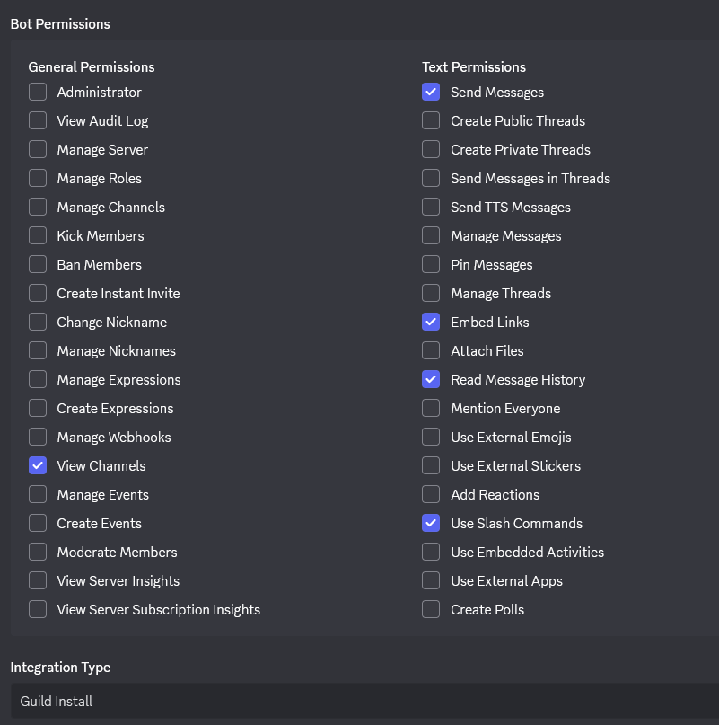

[//]: # (Copyright © 2025 ollprogram)

[//]: # ( This file is part of TwitchDiscordBridge.
TwitchDiscordBridge is free software: you can redistribute it and/or modify it under the terms of the GNU General Public License
as published by the Free Software Foundation, either version 3 of the License, or \(at your option\) any later version. 
TwitchDiscordBridge is distributed in the hope that it will be useful, but WITHOUT ANY WARRANTY;
without even the implied warranty of MERCHANTABILITY or FITNESS FOR A PARTICULAR PURPOSE.
See the GNU General Public License for more details.
You should have received a copy of the GNU General Public License along with TwitchDiscordBridge.
If not, see <https://www.gnu.org/licenses/>.)

# TwitchDiscordBridge

Links the [Discord](https://discord.com) chat and the [Twitch](https://www.twitch.tv) chat together.

## Author and Licence

Hi I'm ollprogram, the author of this project. Thanks for using it. **If you spot any bugs, typos, or awkward wording, don’t hesitate to let me know. I’ll do my best to fix them. English isn’t my first language, so any corrections or suggestions are welcome.**

Find information about the licence used for this project [here](LICENSE).

Familiarize yourself with the licence before using my project. It gives information about how you can use it.

## Description

With this application you will be able to link your Twitch chat with a Discord text channel in your discord server (guild).

Whenever someone sends a message in a specific Discord channel, that same message will automatically be forwarded to a designated Twitch chat, and vice versa.

>⚠️ This application is designed to process a high volume of messages. However, due to Twitch’s low request rate limit, latency may occur on channels with significant activity. Therefore, using TwitchDiscordBridge on highly active channels is not recommended.

>⚠️ Using TwitchDiscordBridge on channels you do not own or for which you do not have moderator rights is not recommended.

---

> In this project, I'm often referring to a "Bridge". But, what does a "Bridge" represent in this project?
> A “Bridge” is an object responsible for transferring messages between two destinations : Discord and Twitch, in our case.

## Download

You can download the runnable jar file [here](https://github.com/ollprogram/TwitchDiscordBridge/releases).

## Setup

There are some procedures before launching the program.

### Discord setup

1. You need a [Discord](https://discord.com) account and a Discord server (guild).
2. Register a new bot on the [Discord Developer Portal](https://discord.com/developers/docs/intro) .  
   You should also turn it to private mode.
3. In the installation section, turn on "guild install"
4. In the OAuth2 section, in the OAuth2 URL Generator select the "bot" scope.
   The Discord bot will need some permissions on your server. See the permissions needed in the screenshot below:

   

   If you choose to enable additional permissions, be mindful of their implications. For example, granting the bot permission to mention all roles would allow anyone from Twitch to trigger role-wide mentions on Discord.

5. Use the generated URL to add your bot in your discord guild

### Twitch setup

1. Create a new [Twitch](https://www.twitch.tv) account for your Twitch bot. It's recommended to make your bot a moderator on the Twitch channel where you stream.
2. Create a new twitch application on the [twitch developer portal](https://dev.twitch.tv/console) with your bot account

---

### First launch

Here are the prerequisites for first time launch :

1. Your Discord bot token `discord dev portal > bot > copy or reset token and copy`.
2. Your Twitch bot user access token. You have multiple options for getting it :
   - You can use the go script available in the [releases section](https://github.com/ollprogram/TwitchDiscordBridge/releases).
   For this script you will need you twitch application client id `twitch dev > your console > manage app > copy you client id`
     ```bash 
     # linux / bash
     ./retrieve_twitch_token <your twitch app client id>
     ```
     ```shell
     # windows / powershell
     ./retrieve_twitch_token.exe <your twitch app client id>
     ```
   - Or you can use this token generator online (https://twitchtokengenerator.com/) if you trust it, and if it works for you. 
   - It's also possible to use the Twitch CLI.
3. A Twitch channel name (The channel where you stream).
4. A Discord channel ID. You need to activate first dev mode on Discord `advanced -> developer_mode -> on`. Right-click on the channel where you want your bot to listen to it, and copy the ID.

## Usage

### To launch the program with the console interface

`java -jar TwitchDiscordBridge-1.0-shaded.jar` (cmd, powershell or bash)

### To list all commands

Type `help` in the console.

### All commands on discord

- `/code` to get source code information.
- `/bridge discord_target <channel_id>` change the discord channel target
- `/bridge twitch_target <channel_name>` change the twitch channel target
- `/bridge open` open the bridge.
- `/bridge close` close the bridge.
- `/bridge info` get information about the bridge.

### All commands in the console

- `help` see all commands
- `shutdown` shutdown the app without exceptions (wait all tasks end).
- `shutdown now` shutdown the app with exceptions.
- `say <your message>` send a message on both platforms.
- `/code` to get source code information.
- `/bridge discord_target <channel_id>` change the discord channel target
- `/bridge twitch_target <channel_name>` change the twitch channel target
- `/bridge open` open the bridge.
- `/bridge close` close the bridge.
- `/bridge info` get information about the bridge.

## How to contribute?

Contribution guidelines are available [here](CONTRIBUTING.md).

## Report a bug, something to improve or ask for help

You can create an [issue](https://github.com/ollprogram/TwitchDiscordBridge/issues) to ask us something by following the related template :
- refactor request
- feature request
- question or help
- bug report

